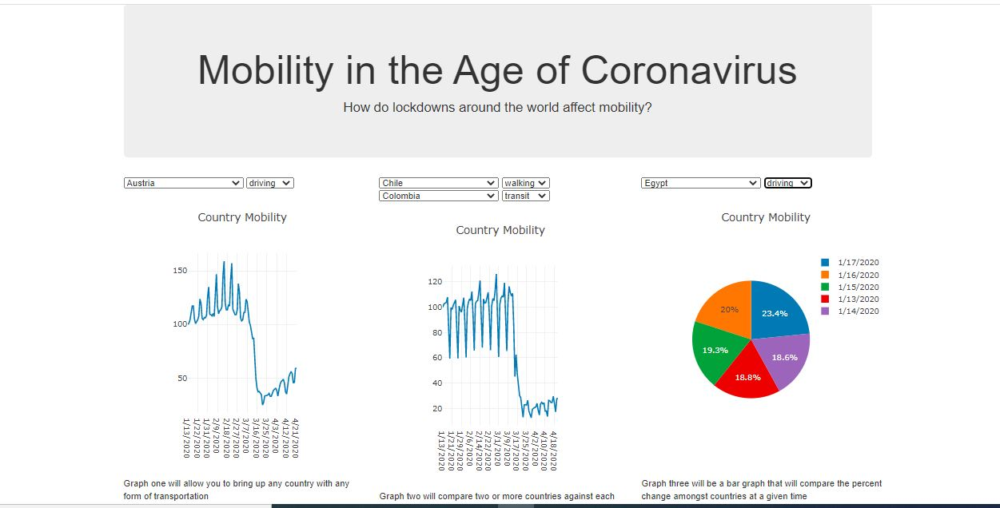

# Mobility-Project

The relationship between mobility and covid-19 during QI of 2020 was investigated. We wanted to figure out whether subsequent shutdowns have affected people's mobility in different cities and countries around the world.

# How to Run Code

1). Copy and paste this link https://covid19-mobility.herokuapp.com/ into your browser. 

# Technologies Used:

Pandas, Python, Flask, SQL, Postgres, HTML, JavaScript, CSS, Plotly, Git, Github

# Data

- Mobility data was extracted from Apple in a csv. Mobility scores were given out of 100 depending on how frequently transit options (walking,driving,biking), would be searched in Apple Maps. 

- Covid-19 data was extracted from WHO also in csv format.

# Data cleaning, manipulation, and application development process:

 -Mobility data was manipulated in pandas to be in first normal form.
- Mobility data was inserted into a Postgres database.
- A connection was established in Flask to serve up the mobility data
- to our javascript file
- A route to our html was established using Flask
- Graphs were created using plotly to demonstrate mobility trends over time in various countries

## Screenshots

Displays a comparison of mobility scores among various countries over time. We used plotly to create the graphs because we wanted the user to have dynamic interactions in the application.

# Conclusions
- Mobility scores have decreased over time
- During the early phased shutdowns, transit peaks would occur on weekends as opposed to weekdays.

